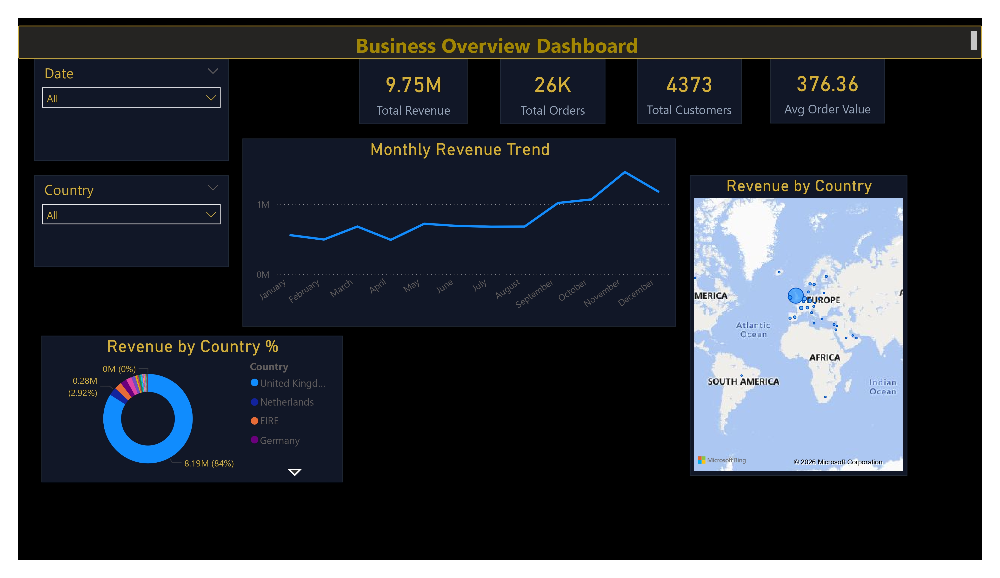
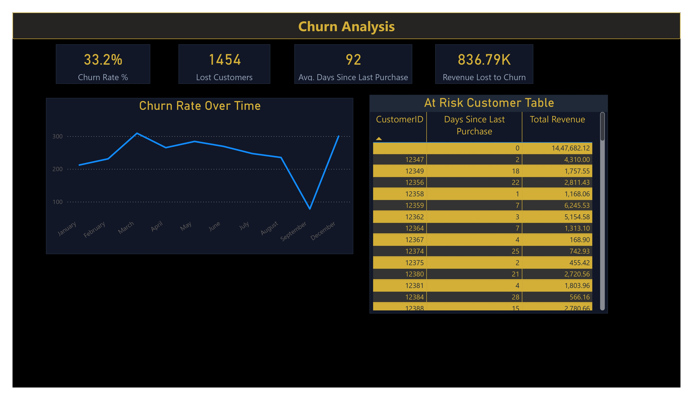

# 📊 Subscription & Sales Analysis – SQL + Power BI

## 🎯 Project Objective

This project analyzes online retail transaction data using **SQL for data processing** and **Power BI for visualization**.
The goal is to track revenue performance, customer behavior, and identify churn & at-risk customers to support business decisions.

---

## 🛠 Tools & Technologies

* **MySQL** – Data cleaning & analysis
* **Power BI** – Dashboard & visualization
* **SQL** – KPI calculations
* **Excel/CSV** – Raw dataset

---

## 📂 Dataset Overview

The dataset contains:

* Invoice information
* Product details
* Quantity & price
* Customer ID
* Country
* Invoice date

More than **50,000+ records** were processed and transformed using SQL.

---

## 🧹 Data Cleaning & Transformation

* Converted `InvoiceDate` from text → DATETIME
* Created calculated column: **Revenue = Quantity × UnitPrice**
* Handled null Customer IDs
* Structured table for analytics

---

## 📊 KPIs Implemented

* Total Revenue
* Total Customers
* Average Order Value
* Monthly Revenue Trend
* Top Customers
* Revenue by Country
* Churn Customers (90-day rule)
* Revenue at Risk

---

## 📈 DASHBOARD PREVIEW

### 1️⃣ Business Overview

### 2️⃣ Customer Analysis

### 3️⃣ Churn Analysis

---

## 🧪 SQL Analysis Highlights

* Revenue aggregation
* Monthly trend analysis
* Top customer identification
* Country wise performance
* At-risk customer detection using 90-day inactivity logic

---

## 🚀 Key Insights

* A small group of customers generates majority revenue
* Strong seasonality observed in year-end months
* Large number of customers inactive for 90+ days
* UK contributes highest share of revenue
* Significant revenue is “at risk” due to churn

---

## 📁 Repository Structure

* **/sql** – SQL scripts
* **/powerbi** – Dashboard file
* **/screenshots** – Report images
* **/dataset** – Raw data (if included)

---

## ▶ How to Use

1. Run SQL scripts sequentially
2. Load data into MySQL
3. Connect Power BI to database
4. Open PBIX and refresh

---

## 📌 Conclusion

This project demonstrates a complete analytics workflow:

➡ Data Cleaning → SQL Analysis → KPI Creation → Power BI Visualization → Business Insights

---

### 👤 Author

**Sayma Khatoon**
Aspiring Data Analyst
